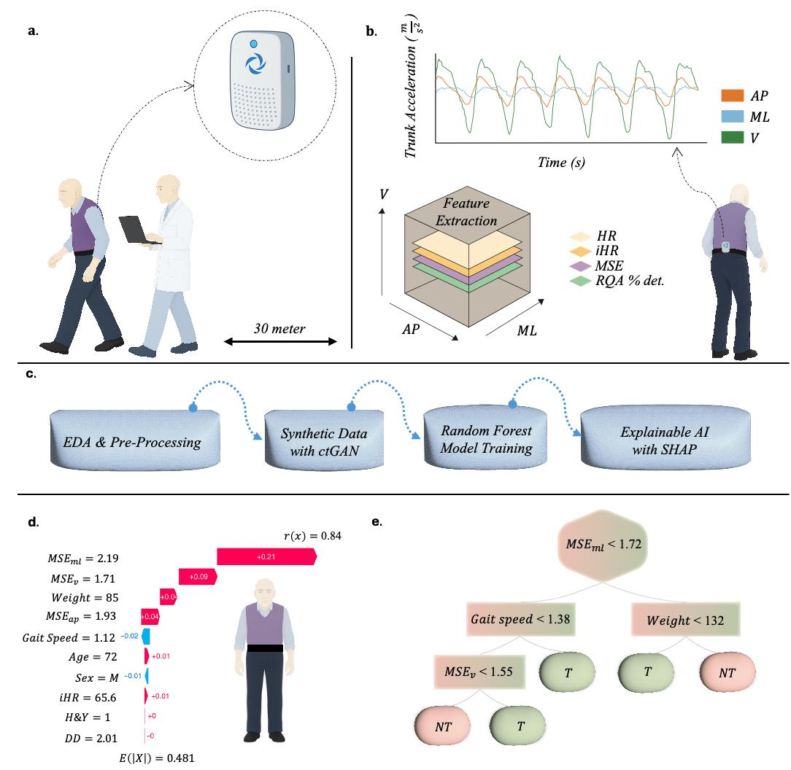
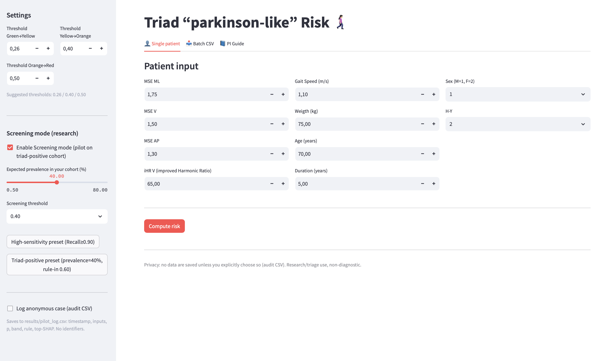
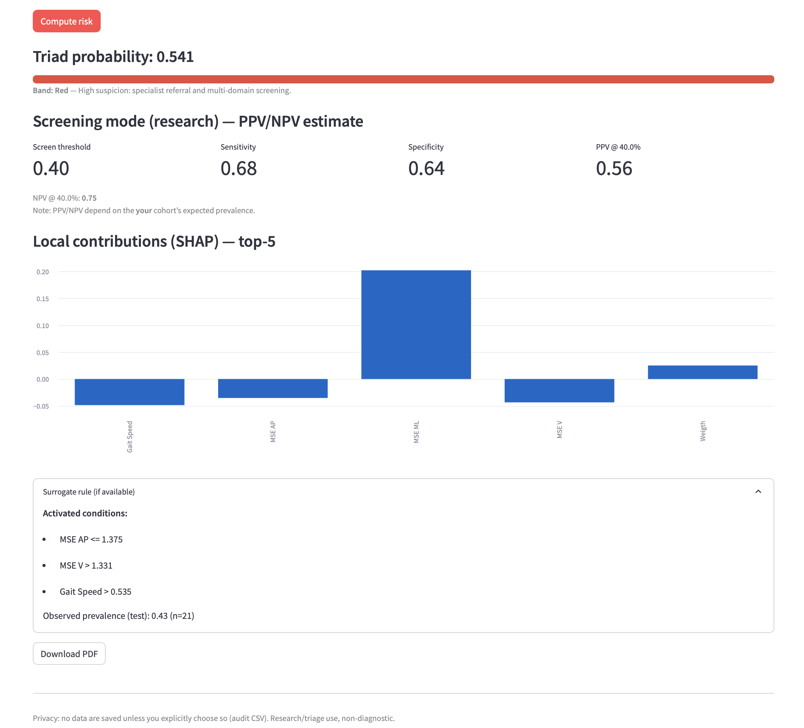
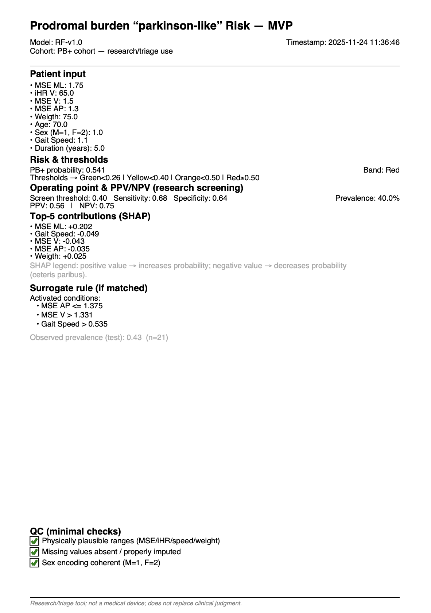

# 🚶🏻‍♀️ PB2PD — Prodromal Burden to Parkinson’s Disease — MVP



> **From in-PD prodromal burden to prospective screening tools.**  
> This project extracts and explains gait-based biomechanical signatures associated with the “prodromal burden” phenotype (PB+ vs PB–) in patients already diagnosed with Parkinson’s disease.  
> The resulting signatures are designed to inform future *screening studies* on normative subjects with prodromal symptoms.

---

## 🔍 Overview

PB2PD analyzes **lumbar IMU–derived gait features** from a PD cohort stratified by prodromal burden (PB+ / PB–), where PB includes combinations of:

- REM Sleep Behavior Disorder (RBD)  
- Hyposmia  
- Depression  
- Constipation

The aim is to identify **stable biomechanical signatures**, validated with **explainable AI**, that may guide future studies on prodromal subjects *without* diagnosed PD.

**Key components:**
- Lazy Prediction for benchmark screening  
- Balanced Random Forest (with ctGAN data balancing)   
- SHAP explainability (global + local)  
- Surrogate clinical rules (interpretable trees)orts.  

---

##  Webapp (Streamlit MVP)

| Patient input | Risk results | PDF export |
|---------------|--------------|------------|
|  |  |  |

Key features:
- Single patient **or batch CSV** input.  
- **Color-coded risk bands** (green/yellow/orange/red).  
- **Screening mode**: set prevalence → PPV/NPV estimate.  
- **Local SHAP contributions (top-5)** for clinical transparency.  
- **Surrogate rules** (interpretable tree) for clinical validation.  
- **PDF export** with minimal QC, thresholds, SHAP, and rules.  

---

##  Architecture

- **Notebooks (EDA, preprocessing, explainability, robustness)** → `/notebooks`  
- **Models & scaler** → `/models`  
- **Surrogate rules (JSON/YAML)** → `/artifacts`  
- **Streamlit app** → `/app/app.py`

Integrated pipeline → from biomechanical analysis to clinical reports.  

---

##  Key Techniques

- **Generative data balancing** → ctGAN  
- **Advanced explainability** → SHAP, SHAPSet plot, surrogate tree with 95% CI  
- **Robustness analysis** → cross-validation, subgroup analysis, calibration  
- **Decision support** → Decision Curve Analysis (Net Benefit)  

---

##  Example of PDF Report


📄 [Download full PDF](assets/PB_report.pdf)

Includes:
- Patient input  
- Triad probability + risk band  
- Sensitivity/Specificity @ threshold  
- PPV/NPV at custom prevalence  
- SHAP top-5 contributions  
- Surrogate rule matched  
- Minimal QC (range, missing, sex)  

---

## 🚀 Setup & Run

Clone the repo and run the Streamlit app:

```bash
git clone https://github.com/DanteTrb/PB2PD.git
cd PB2PD/app
pip install -r ../requirements.txt
streamlit run app.py
```

## 🧑‍🔬 Clinical Research Disclaimer
	•	Research/triage use only.
	•	Does not replace clinical judgment.
	•	Not a certified medical device.

## 🏆 Credits & Vision
	•	Author: Dante Trabassi, Sapienza University of Rome

[](https://doi.org/10.5281/zenodo.17683693)