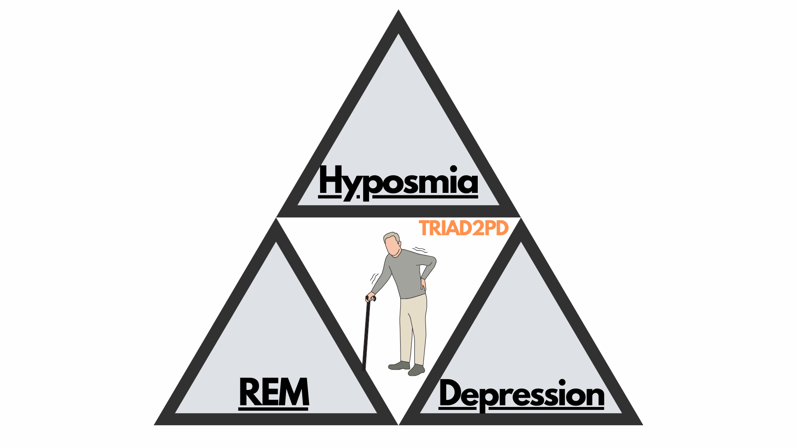

# 🚶🏻‍♀️ Triad “parkinson-like” Risk — MVP



> **Explainable-first AI screening for triad-positive subjects (RBD, hyposmia, depression)**  
> MVP designed for prospective research: risk prediction, surrogate clinical rules, and SHAP interpretability.  

---

## ✨ Overview

This project introduces a **decision-support system for selecting “triad-positive” subjects** (prodromal Parkinson’s disease) for prospective studies.  
It is **not a medical device**, but a **research/triage tool**, ready to be validated in clinical trials.

- **Core algorithm**: Balanced Random Forest (ctGAN + Lazy Prediction).  
- **Explainability**: SHAP (global/local), surrogate tree, clinical rules.  
- **Screening mode**: Decision Curve Analysis, PPV/NPV at custom prevalence.  
- **Output**: Streamlit webapp + individual PDF reports.  

---

## 🖥️ Webapp (Streamlit MVP)

| Patient input | Risk results | PDF export |
|---------------|--------------|------------|
|  |  |  |

Key features:
- Single patient **or batch CSV** input.  
- **Color-coded risk bands** (green/yellow/orange/red).  
- **Screening mode**: set prevalence → PPV/NPV estimate.  
- **Local SHAP contributions (top-5)** for clinical transparency.  
- **Surrogate rules** (interpretable tree) for clinical validation.  
- **PDF export** with minimal QC, thresholds, SHAP, and rules.  

---

## 📊 Architecture

- **Notebooks (EDA, preprocessing, explainability, robustness)** → `/notebooks`  
- **Models & scaler** → `/models`  
- **Surrogate rules (JSON/YAML)** → `/artifacts`  
- **Streamlit app** → `/app/app.py`  
- **Results/metrics** → `/tables` and `/figurez`  

Integrated pipeline → from biomechanical analysis to clinical reports.  

---

## 🔍 Key Techniques

- **Generative data balancing** → ctGAN  
- **Advanced explainability** → SHAP, SHAPSet plot, surrogate tree with 95% CI  
- **Robustness analysis** → cross-validation, subgroup analysis, calibration  
- **Decision support** → Decision Curve Analysis (Net Benefit)  

---

## 📑 Example of PDF Report


Includes:
- Patient input  
- Triad probability + risk band  
- Sensitivity/Specificity @ threshold  
- PPV/NPV at custom prevalence  
- SHAP top-5 contributions  
- Surrogate rule matched  
- Minimal QC (range, missing, sex, H-Y)  

---

## 🚀 Setup & Run

Clone the repo and run the Streamlit app:

```bash
git clone https://github.com/DanteTrb/Triad2PD.git
cd Triad2PD/app
pip install -r ../requirements.txt
streamlit run app.py
```

## 🧑‍🔬 Clinical Research Disclaimer
	•	Research/triage use only.
	•	Does not replace clinical judgment.
	•	Not a certified medical device.

## 🏆 Credits & Vision
	•	Author: Dante Trabassi, Sapienza University of Rome
	•	Focus: Explainable AI for prodromal Parkinson’s disease
	•	Goal: bringing transparency and biomechanical rigor to clinical trials.